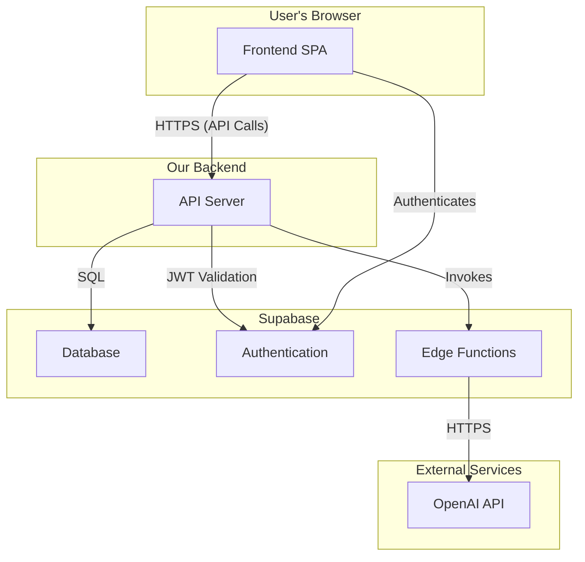

import { DiagramSpoiler } from '@/components/system-overview/DiagramSpoiler';
import { Card, CardGrid } from '@/components/system-overview/Card';

# Application Architecture

This documentation uses a simplified approach inspired by the **C4 model** for visualizing software architecture. We focus on the most critical diagrams to provide a clear and understandable overview of the system.

-   **System Context (This Page):** A high-level view showing how the Liara application interacts with its users and other systems.
-   **Containers / Components:** We use component diagrams to show the major building blocks of the system. See the <Keyword to="/app/system-overview/architecture/component-diagram">Component Diagram</Keyword>.
-   **Deployment:** A diagram showing how these components are deployed into production. See the <Keyword to="/app/system-overview/architecture/deployment-diagram">Deployment Diagram</Keyword>.

## System Context Diagram

This diagram shows the Liara system as a whole and its interactions with the outside world.

<Diagram>
{`
graph TD
    subgraph "Liara System"
        direction LR
        B["Backend (Node.js/Express)"]
        A["Frontend (React/Vite)"]
        C["Database (Supabase/Postgres)"]
        
        A -- "API Calls (HTTPS)" --> B
        B -- "Data Storage/Retrieval (SQL)" --> C
    end

    User[User] -- "Interacts via Browser" --> A
    B -- "API Calls to Large Language Model" --> D["AI Service (e.g., OpenAI)"]

    style User fill:#0a407a,stroke:#fff,stroke-width:2px,color:#fff
    style D fill:#993399,stroke:#fff,stroke-width:2px,color:#fff
`}
</Diagram>

### Key Interactions:

-   **User & Frontend:** The user interacts with Liara through the web application built with React and Vite. All user actions, such as sending a message or viewing memories, are initiated from the <Keyword to="/app/system-overview/architecture/frontend">Frontend</Keyword>. The frontend is responsible for all rendering and state management on the client side.

-   **Frontend & Backend:** The frontend communicates with the backend via a secure, token-based REST API. It sends user inputs (like chat messages) and receives data to display (like memories or streaming AI responses). All API calls are made over HTTPS.

-   **Backend & Database:** The <Keyword to="/app/system-overview/backend/server-overview">Backend</Keyword> is the only component with direct access to the <Keyword to="/app/system-overview/database/01-schema-and-tables">Supabase Database</Keyword>. It handles all data creation, retrieval, updates, and deletion (CRUD). This centralization ensures that data access is secure and consistent, governed by the logic in the backend's service layer.

-   **Backend & AI Service:** The backend is responsible for all communication with the external AI services (like OpenAI). It constructs detailed prompts, sends them to the AI, and processes the responses—often streaming them back to the frontend—before storing the final results in the database. This isolates the AI-specific logic and API keys from the client.

## Core Architectural Principles

The Liara application is designed as a modern, containerized web application with a clear separation of concerns between the frontend, backend, and data persistence layers. This approach, often referred to as a **three-tier architecture**, allows for independent development, scaling, and maintenance of each part of the system.

<CardGrid>
    <Card title="Frontend: Single-Page Application" icon="PanelsTopLeft">
        The user interface is a responsive **Single-Page Application (SPA)** built with React and Vite. This provides a fast, fluid user experience without requiring a full page reload for every interaction.
    </Card>
    <Card title="Backend: API Server" icon="Server">
        The backend is a **Node.js/Express server** that exposes a RESTful API. It handles all business logic, orchestrates calls to external services like OpenAI, and manages communication with the database.
    </Card>
    <Card title="Data & Services: Supabase" icon="Database">
        We use **Supabase** as our all-in-one backend-as-a-service provider. This includes a PostgreSQL database for data storage, an authentication service for user management, and serverless edge functions for isolated, intensive tasks.
    </Card>
</CardGrid>

## High-Level Data Flow

The diagram below illustrates the primary data flow and interactions between the major system components. For a more detailed breakdown, see the [Component Diagram](/app/system-overview/architecture/component-diagram).

<DiagramSpoiler>

</DiagramSpoiler>

## New: ChatGPT Import Pipeline

A significant new component of the system is the **ChatGPT Import Pipeline**. This feature allows users to import their conversation history directly from a `conversations.json` file. The process is managed through a dedicated UI and involves several steps handled across the client and backend.

### Import Pipeline Flow:

1.  **File Upload & Parse (Client):** The user selects their `conversations.json` file in the UI. The frontend parses the file entirely in the browser, presenting a preview of the conversations and allowing the user to select which ones to process.
2.  **Enrichment (Backend):** On user request, selected conversations are sent to a dedicated `/api/import/enrich` endpoint. The backend orchestrates calls to the OpenAI API to generate summaries, tags, and vector embeddings for each message. A separate `/api/import/stream-logs` endpoint provides real-time progress to the client via Server-Sent Events.
3.  **Load to DB (Backend):** After enrichment, the user triggers the final load step. The frontend sends the complete data (enriched and non-enriched) to the `/api/import/load` endpoint, which uses an `upsert` operation to save the new memories to the PostgreSQL database, preventing duplicates.

This architecture ensures the user has a fast, interactive experience on the frontend while offloading the heavy processing and data storage tasks to the backend and database.
