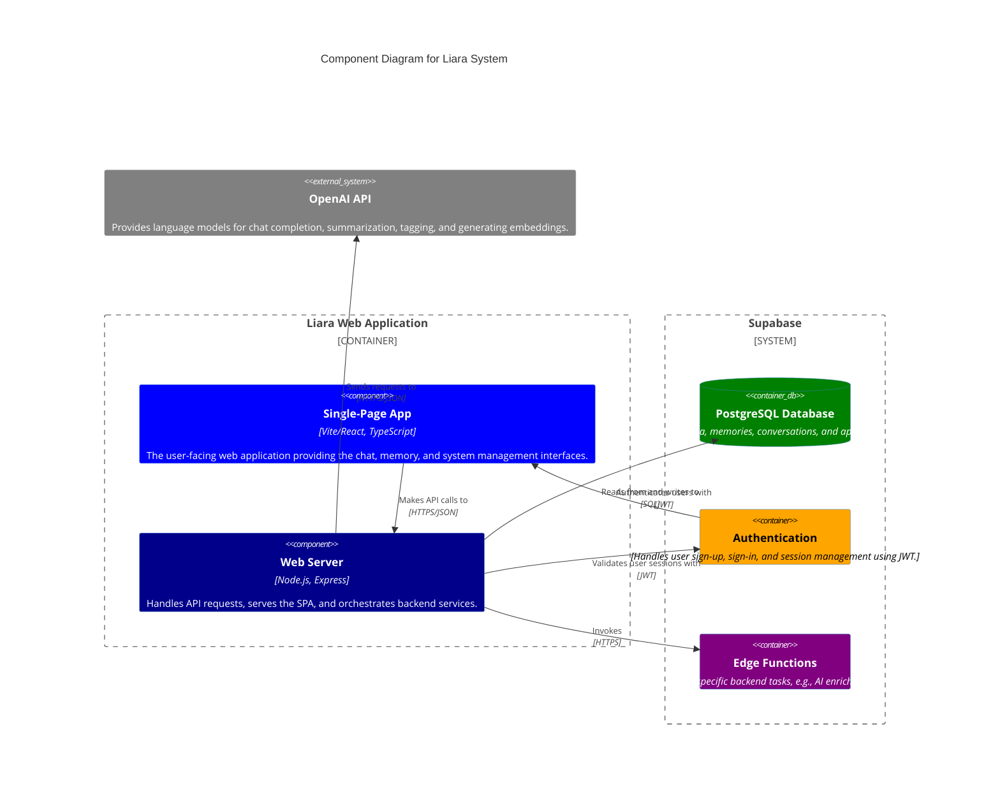

import { DiagramSpoiler } from '@/components/system-overview/DiagramSpoiler';

## Component Diagram (C4 Model - Level 2)

This diagram shows the main containers (applications and data stores) that make up the Liara system. It illustrates the high-level technical choices and how the core parts of the system interact with each other and with external services.

<DiagramSpoiler>

</DiagramSpoiler>

### Key Components:

-   **Single-Page App (SPA):** The frontend application built with React and Vite. This is what the user interacts with directly in their browser. It's responsible for rendering the UI, managing local state, and communicating with the backend web server.
-   **Web Server:** A backend server built with Node.js and Express. It serves the SPA, provides a RESTful API for the frontend, and acts as a central hub for backend logic.
-   **Supabase (PostgreSQL Database):** The primary data store for the application. It holds all persistent data, including user profiles, memories, and chat histories.
-   **Supabase (Authentication):** The service that manages user identity. It handles everything from signing up and logging in to managing user sessions.
-   **Supabase (Edge Functions):** These are serverless functions used for specific, often intensive, tasks. For example, an edge function might be responsible for calling the OpenAI API to enrich a conversation, keeping that logic separate from the main web server.
-   **OpenAI API:** An external, third-party service that provides the core AI capabilities for Liara, including natural language understanding, text generation, and creating vector embeddings.

