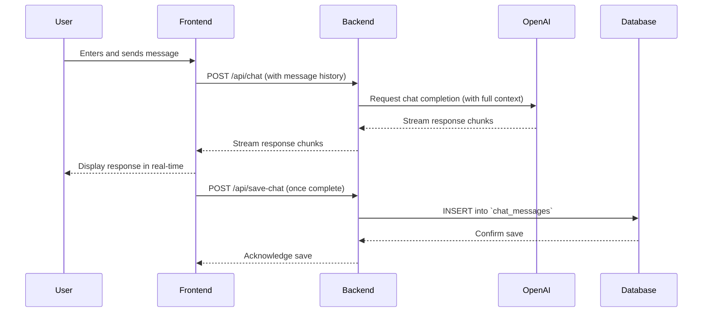
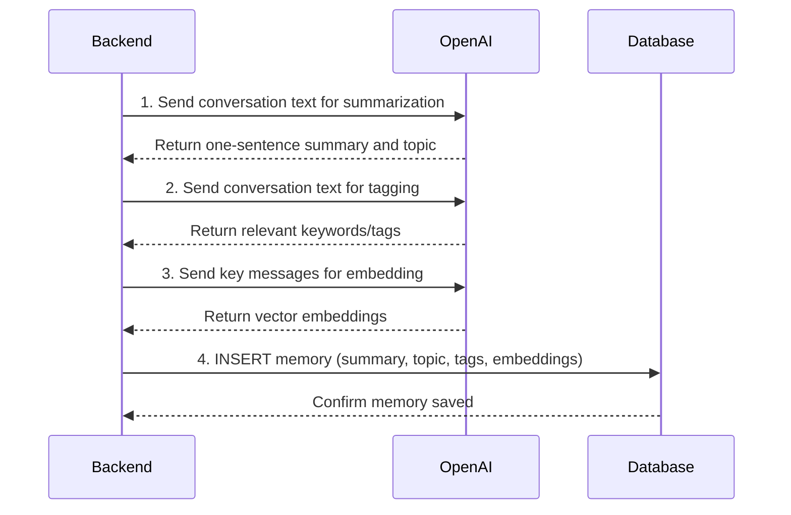
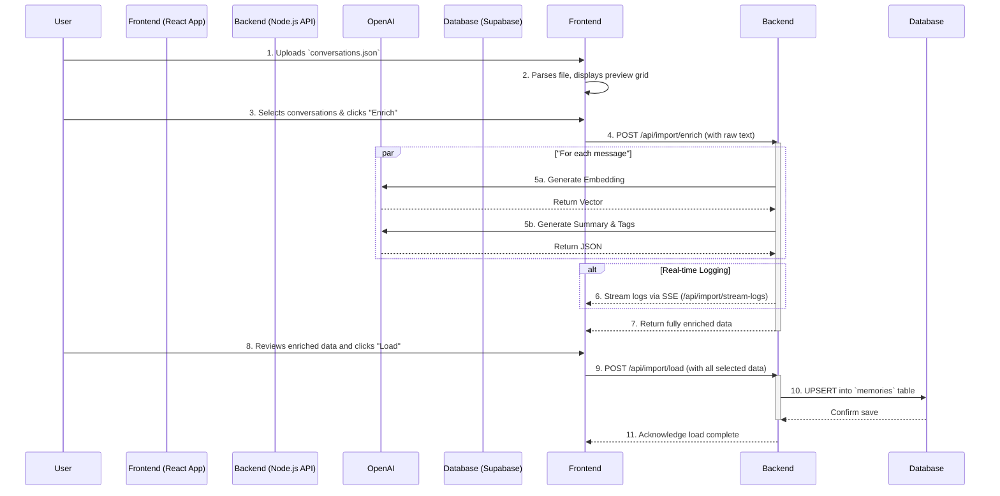

import { DiagramSpoiler } from '@/components/system-overview/DiagramSpoiler';

## Data Flow Diagrams

This section provides detailed diagrams for the most critical user-facing and backend processes in the Liara application.

### 1. Core Chat Message Flow

This diagram shows the sequence of events when a user sends a message and receives a response from Liara.

<DiagramSpoiler>

</DiagramSpoiler>

### 2. Memory Enrichment & Save Flow

This diagram illustrates the backend process for how a completed chat conversation is turned into a long-term, searchable memory.

<DiagramSpoiler>

</DiagramSpoiler>

### 3. ChatGPT Import Pipeline Flow

This diagram details the steps involved in the user-initiated import process, from file upload to final database insertion. It highlights the separation between the client-side parsing, backend enrichment, and final loading steps.

<DiagramSpoiler>

</DiagramSpoiler> 