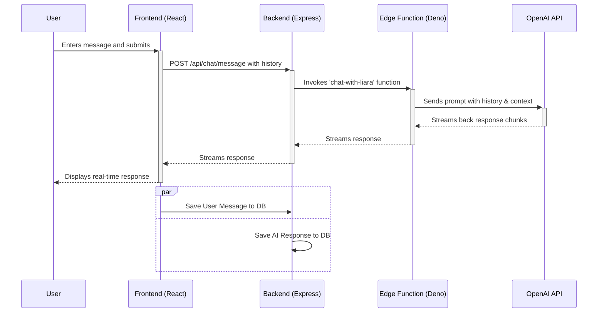

# Chat Session Flow

This describes the flow of data during a typical chat session.

1.  **User Sends Message:** The user types a message in the `ChatInput` component and submits it.
2.  **API Call:** The frontend calls the `POST /api/chat/message` endpoint on the backend.
3.  **Edge Function:** The backend server invokes the `chat-with-liara` Supabase Edge Function, passing the message history and personality context.
4.  **OpenAI:** The Edge Function communicates with the OpenAI API to get a response.
5.  **Response Stream:** The response is streamed back through the backend to the frontend.
6.  **UI Update:** The `ChatPage` displays the incoming message chunks in real-time.
7.  **History Save:** Both the user's message and the AI's full response are saved to the `chat_history` table. 