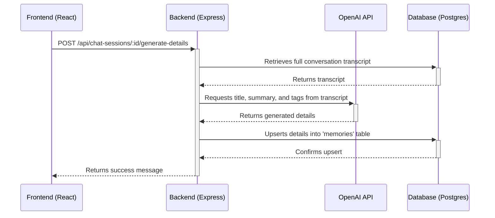

# Memory Save Flow

This flow is triggered at the end of a chat session to generate a summary and tags.

1.  **User Finishes Chat:** The user navigates away from the chat page or the session ends.
2.  **Frontend Trigger:** The frontend calls `POST /api/chat-sessions/:id/generate-details`.
3.  **Backend Logic:** The backend retrieves the full conversation from the `chat_history` table for the given session ID.
4.  **OpenAI Call:** It sends the transcript to OpenAI with a specific prompt asking for a title, a one-paragraph summary, and a list of relevant topic tags.
5.  **Database Upsert:** The backend receives the response and performs an "upsert" operation on the `memories` table using the `chat_session_id` as the unique key. This creates a new memory or updates the existing one with the generated title, summary, and tags. 