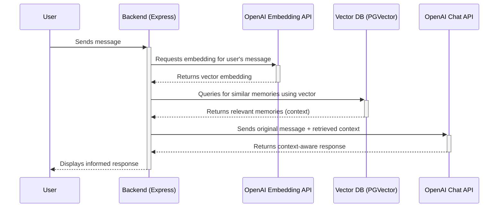

# Semantic Recall Flow

This describes how Liara recalls relevant memories during a conversation. This is also known as Retrieval-Augmented Generation (RAG).

1.  **User Sends Message:** The user sends a message that might trigger a memory lookup.
2.  **Embedding Generation:** The backend creates a vector embedding of the user's latest message using OpenAI's embedding API.
3.  **Vector Search:** This new vector is used to query the `memories` table in the PGVector database. The query looks for the most semantically similar memories (i.e., the "nearest neighbors" in vector space).
4.  **Context Injection:** The content of the top matching memories is retrieved.
5.  **Prompt Augmentation:** This retrieved information is injected into the prompt that is sent to the `chat-with-liara` Edge Function. This is called Retrieval-Augmented Generation (RAG).
6.  **Informed Response:** The LLM uses this extra context to provide a more informed and personalized response to the user. 