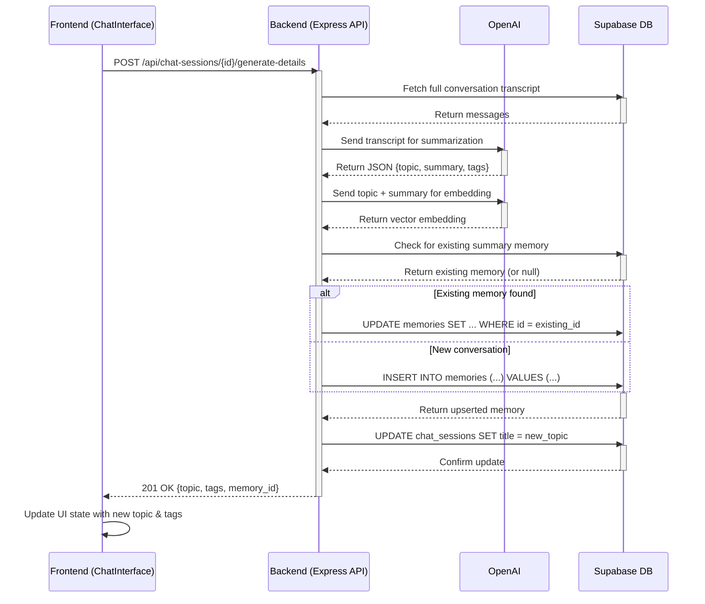

# Generate Details Flow

The "Generate Details" feature provides a one-click method to create a high-level summary of a chat conversation. It uses OpenAI's `gpt-3.5-turbo` model to analyze the full transcript and extract a concise topic, a 2-3 sentence summary, and a list of relevant tags. This information is then saved as a special type of memory for future reference and search.

The process ensures that each conversation has only one canonical summary, preventing data duplication by updating existing summaries if the button is clicked again.

## Data Flow Diagram

The following diagram illustrates the end-to-end process, from the user's click to the final data storage.

## Backend Logic (`/generate-details`)

1.  **Authentication & Authorization**: The endpoint first verifies the user's JWT and confirms that the requested `chat_session_id` belongs to them.
2.  **Fetch Transcript**: It retrieves all messages associated with the session from the `chat_history` table.
3.  **OpenAI Call**: The full transcript is sent to `gpt-3.5-turbo`. The system prompt is specifically engineered to request a response in a structured JSON format with `topic`, `summary`, and `tags` keys.
4.  **Embedding**: A second OpenAI call to the `text-embedding-ada-002` model generates a vector embedding from the topic and summary. This is used for semantic search on the Memory page.
5.  **Upsert to `memories` Table**:
    *   The backend first queries the `memories` table for an entry where `source` is `conversation_summary` and the `metadata.chat_session_id` matches the current session.
    *   If a record is found, it is **updated** with the new content, summary, tags, and embedding.
    *   If no record is found, a new one is **inserted**.
    *   This prevents duplicate summary entries for the same conversation.
6.  **Update `chat_sessions` Table**: The `title` of the conversation in the `chat_sessions` table is updated to match the AI-generated `topic`. This ensures consistency across the application, like in the "Recent Conversations" list.
7.  **Response**: The backend returns the newly generated `topic` and `tags` to the frontend.

## Frontend Logic

1.  **State Management**: The `ChatInterface` component manages the state of the generated details (`generatedDetails`).
2.  **API Call**: When the "Generate Details" button is clicked, the `handleGenerateDetails` function is called, which makes a `POST` request to the backend endpoint.
3.  **UI Update**:
    *   On a successful response, the frontend immediately uses the `topic` and `tags` from the API response to update its local state (`setGeneratedDetails`).
    *   It also calls the `renameConversation` function, which handles the logic of updating the conversation's title in the UI and refreshing the recent conversations list.
    *   This client-side state update prevents the need for a disruptive full reload or re-fetch, providing a smooth user experience.
4.  **Data Persistence**: On subsequent loads (e.g., page refresh or switching conversations), a `useEffect` hook in `ChatInterface` fetches the summary details from the `memories` table, ensuring the tags are always displayed for conversations where they have been generated. 