# Modules

This section describes the core modules of the Liara system.

# Modules Overview

This section provides an overview of the key modules in the Liara application.

```mermaid
graph TD
    subgraph Frontend
        A[Chat Interface] --> B{API Service};
        C[Memory Page] --> B;
        D[System Overview] --> B;
        E[Main Layout] --> A;
        E --> C;
        E --> D;
    end

    subgraph Backend
        B --> F[Chat Routes];
        B --> G[Memory Routes];
        B --> H[Docs Routes];
        F --> I[Chat/RAG Edge Function];
        G --> J[DB Service];
        H --> K[File System];
    end
    
    subgraph External
      I --> L[OpenAI API]
      J --> M[Postgres DB]
    end


    style Frontend fill:#252A3D,stroke:#3B82F6
    style Backend fill:#3D252A,stroke:#F63B82
    style External fill:#2A3D25,stroke:#82F63B
```

This section describes the core functional modules of the application. 