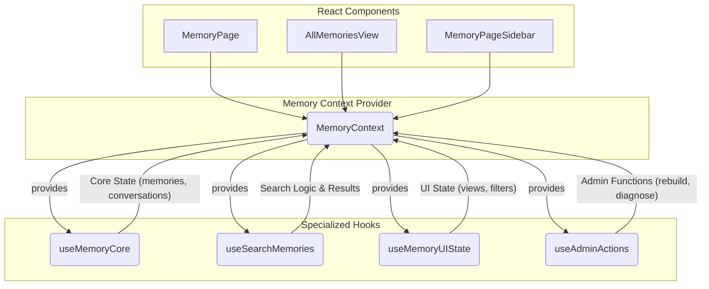

# Frontend Hooks for Memory Management

This document provides a detailed overview of the modular hooks-based architecture responsible for managing all state and user interactions on the Memory page. This system was implemented to replace a monolithic and bug-prone `use-memory-state.tsx` hook, promoting maintainability, stability, and separation of concerns.

## Core Architecture

The architecture is centered around a React Context (`MemoryContext`) that provides a single, unified interface to a set of specialized hooks. Each hook has a distinct responsibility, from core data management to UI state.

<DiagramSpoiler title="Memory Hooks Architecture">

</DiagramSpoiler>

---

## 1. `MemoryContext.tsx` & `useMemory()`

-   **Purpose**: The centerpiece of the architecture. `MemoryContext` is a React context provider that initializes all the specialized memory hooks and exposes their state and functions in a single, unified object.
-   **Hook**: `useMemory()`
-   **Usage**: Any component that needs to interact with the memory system can simply call `const { memories, search, activeView, setActiveView } = useMemory();` to get access to everything it needs. This completely decouples the components from the underlying implementation details.

---

## 2. `useMemoryCore.ts`

-   **Purpose**: The foundational hook responsible for handling the core, foundational state of the memory system. It does not concern itself with UI or complex search logic.
-   **Key Responsibilities**:
    -   **Initial Data Fetching**: On page load, it fetches the user's essential data: all memories, recent conversations, tags, and topics.
    -   **State Management**: It holds the master lists of `memories`, `conversations`, `tags`, and `topics` in React state.
    -   **Conversation Management**: Contains the logic for loading, clearing, and renaming conversations.
    -   **CRUD Operations**: Provides basic functions for creating, updating, and deleting memories and conversations, which are then used by other hooks or components.

---

## 3. `useSearchMemories.ts`

-   **Purpose**: This hook contains all logic related to searching and filtering memories. It takes the master list of memories from `useMemoryCore` and produces a filtered list based on user actions.
-   **Key Responsibilities**:
    -   **State Management**: Manages the `searchQuery`, `searchType` (e.g., 'tag', 'keyword', 'semantic'), and `filteredMemories` state.
    -   **Filtering Logic**: Contains the functions that perform the actual filtering of the main memory list based on the active search query and type.
    -   **API Calls**: Encapsulates the `fetch` calls to the backend for performing server-side searches (like semantic search).

---

## 4. `useMemoryUIState.ts`

-   **Purpose**: This hook is solely responsible for managing the state of the user interface on the Memory page. It knows nothing about the data itself, only how it should be displayed.
-   **Key Responsibilities**:
    -   **View Management**: Manages the `activeView` state (e.g., 'all', 'by_tag', 'story'). This determines which main component is visible on the page.
    -   **Filter Toggles**: Manages the state of UI toggles, such as `showFilters` or the state of specific filter checkboxes.
    -   **Loading & Error States**: Manages UI-specific loading flags (e.g., `isSidebarLoading`) that are distinct from the core data loading state.

---

## 5. Other Custom Hooks

### `useAdminActions.ts`

-   **Purpose**: Consolidates all functions related to the admin-only "Admin Actions Panel."
-   **Key Responsibilities**:
    -   Handles the logic for rebuilding memory embeddings.
    -   Manages the state and logic for the embedding diagnostics tool.
    -   Provides functions for other administrative tasks like clearing system-wide caches.

### `useVoiceInput.ts`

-   **Purpose**: Encapsulates the logic for handling voice input in the chat interface.
-   **Key Responsibilities**:
    -   Uses the browser's `SpeechRecognition` API.
    -   Manages the `isRecording` state.
    -   Handles starting and stopping voice recording.
    -   Updates the chat input field with the transcribed text. 