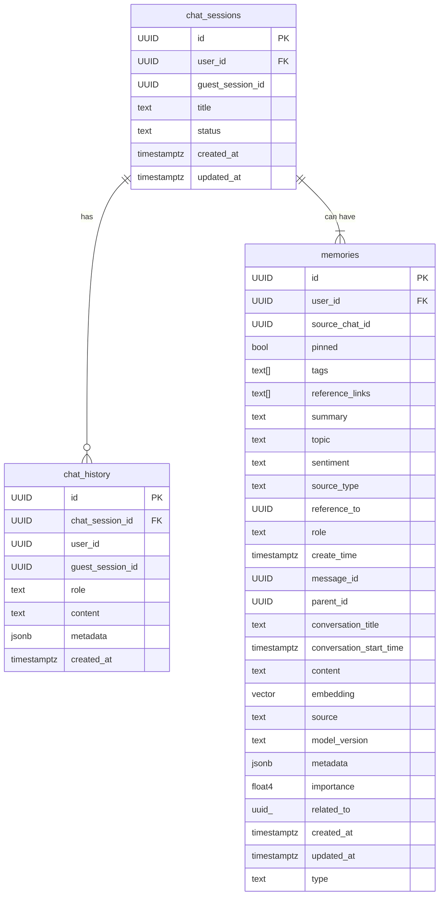

# Database Tables

This section provides details on the database schema and tables.

# Database Tables Overview

This section provides details on the main tables in the PostgreSQL database. 

```mermaid
erDiagram
    chat_sessions {
        UUID id PK
        UUID user_id FK
        UUID guest_session_id
        text title
        text status
        timestamptz created_at
        timestamptz updated_at
    }

    chat_history {
        UUID id PK
        UUID chat_session_id FK
        UUID user_id
        UUID guest_session_id
        text role
        text content
        jsonb metadata
        timestamptz created_at
    }

    memories {
        UUID id PK
        UUID user_id FK
        UUID source_chat_id
        bool pinned
        text[] tags
        text[] reference_links
        text summary
        text topic
        text sentiment
        text source_type
        UUID reference_to
        text role
        timestamptz create_time
        UUID message_id
        UUID parent_id
        text conversation_title
        timestamptz conversation_start_time
        text content
        vector embedding
        text source
        text model_version
        jsonb metadata
        float4 importance
        uuid_ related_to
        timestamptz created_at
        timestamptz updated_at
        text type
    }

    chat_sessions ||--o{ chat_history : "has"
    chat_sessions ||--|{ memories : "can have"
``` 